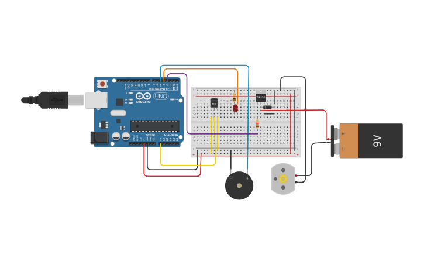

# Desafio - 01

Projeto, simulando uma estufa de hortaliças, desenvolvido no simulador TinkerCad que consiste em um circuito eletrônico envolvendo um sensor de temperatura, uma buzina, um LED e um motor, controlados por meio de um Arduino. 

O projeto possui as seguintes  funcionalidades:

- Leitura de temperatura;
- Acionamento de um motor quando a temperatura for igual ou maior a 30 °C;
- Aciona um LED vermelho e uma buzina Caso a temperatura ultrapasse os 50 °C.

